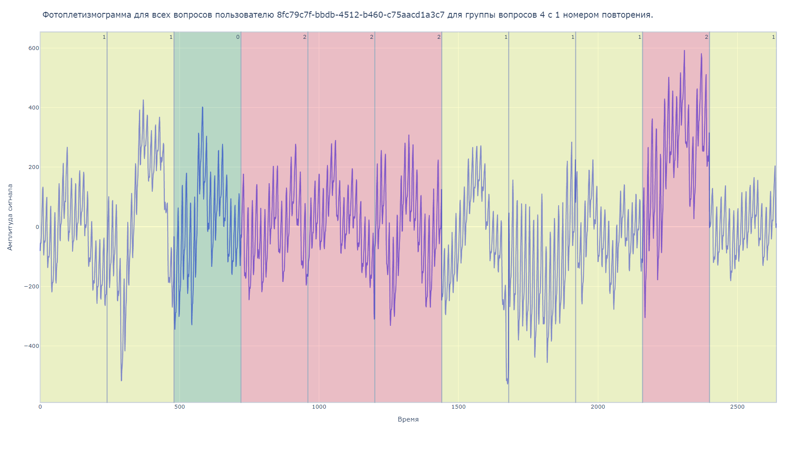
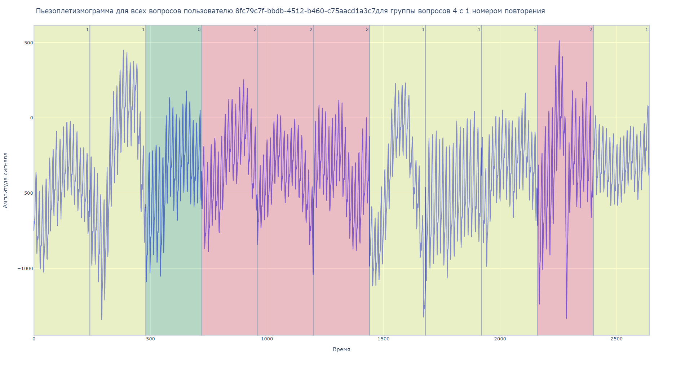

# Детектор уровня стресса от команды Overrated
[](https://badge.fury.io/py/overrated-ld-stress-detector)

Детектор уровня стресса основан на анализе сигналов фотоплетизмограммы и пьезоплетизмограммы с использованием технологий искусственного интеллекта.

На картинке ниже изображен один из результатов анализа сигналов фотоплетизмограммы и пьезоплетизмограммы.  
Введены следующие обозначения: **0** - слабый стресс. **1** - умеренный стресс. **2** - сильный стресс.



# Установка
- `pip install -U overrated-ld-stress-detector`

# Пример использования
```python
import pandas as pd
from overrated_ld_stress_detector.ml import pretrained_model # импорт разработанного решения
from overrated_ld_stress_detector.visualization import utils  # импорт разработанного решения

df = pd.read_excel("models/dataset_train.xlsx", # путь до данных, которые необходимо проанализировать
                   engine='openpyxl') # Загрузка данных из Excel

model = pretrained_model.get_model(model_type='catboost') # Загрузка модели. Доступные модели: 'catboost' и 'cnn'

result = model.predict(df) # Получение результатов анализа.

utils.visualize_data(df,
                     user_id='8fc79c7f-bbdb-4512-b460-c75aacd1a3c7',
                     test_id=3,
                     presentation_id=1,
                     result=result) # визуализация результатов для некоторого пользователя
```

# Используемое решение

- Для исходных данных проводится спектральный и статистический анализ для выделения характерных особенностей сигналов с соответствующим им уровнем стресса.
- На обработанных данных обучены модели машинного обучения, в частности, нейронный сети и градиентный бустинг с последующим блендингом в единый алгоритм определения уровня стресса.
- Для последующей оценки полученных предсказаний, разработанный пакет включает в себя модуль по визуализации исходных сигналов с определенными в процессе классификации уровнями стресса. Это в совокупности представляет собой систему поддержки принятия решений.

# Уникальность:

- Разработанный `python package` является уникальным решением в сфере детектирования уровня стресса, он может быть установлен на любой компьютер с поддержкой python 3 и использован локально, без рисков связанных с возможной утечкой данных.

# Стек используемых технологий:

`python3`, `pypi`, `git`, `github` - инструменты разработки  
`pytorch`, `pytorch-lightning`, `catboost`, `scikit-learn`, `scipy` - фреймворки машинного обучения  
`wandb` - логирование  
`plotly`, `seaborn` - инструменты визуализации  

# Сравнение моделей

- В качестве устойчивой классификационного решения был выбран ансамбль из 5 моделей градиентного бустинга, так как он решает задачу с высокой (70% на отложенной выборке) точностью.
- В качестве  сеть была сверточная нейронная сеть.

# Проводимые исследования

- `research/catboost.ipynb` - исследования с моделями градиентного бустинга
- `research/signal_eda.ipynb` и `research/spec_eda.ipynb` - спектральный и частотный анализ исходных сигналов 


# Разработчики
Имя| Роль | Контакт |
--- | --- | ---  
Суржиков Александр | Data Scientist |  
--- | --- | ---  
Кочетков Максим | Data Scientist | https://t.me/mansasha
--- | --- | ---  
Ванданов Сергей | Data Scientist  | 
--- | --- | ---  
Андрей Стебеньков | Data Scientist  |  